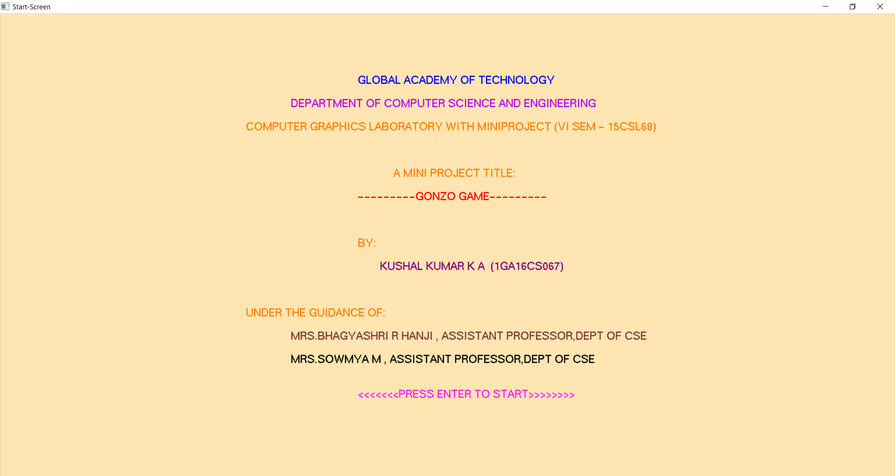
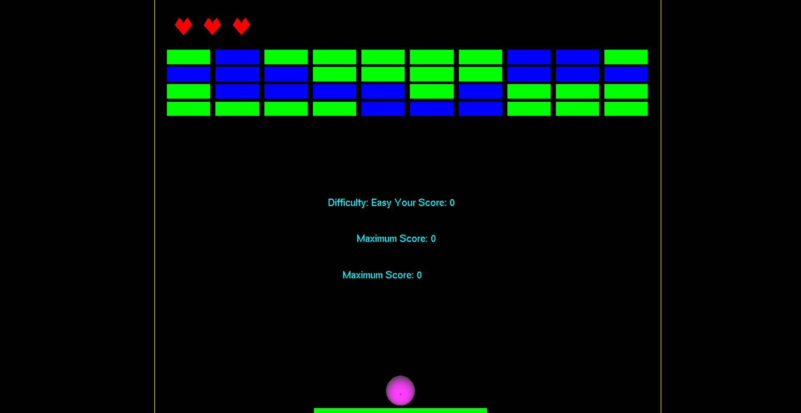
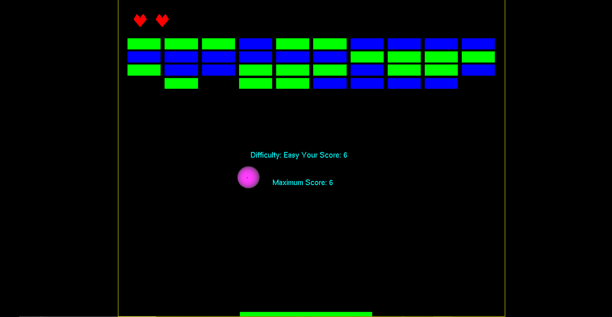
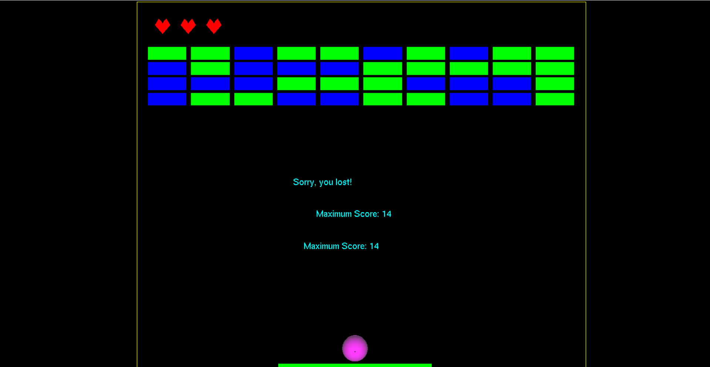

# Bounce
Gameplay. Bounce (platformer) is a Breakout clonewhich the player must smash a wall of bricks by deflecting a bouncing ball with a paddle. The paddle may move horizontally and is controlled with the BlackBerry's trackwheel, the computer's mouse or the keyboard.

